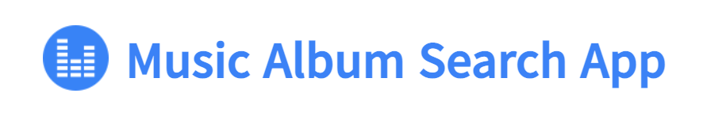
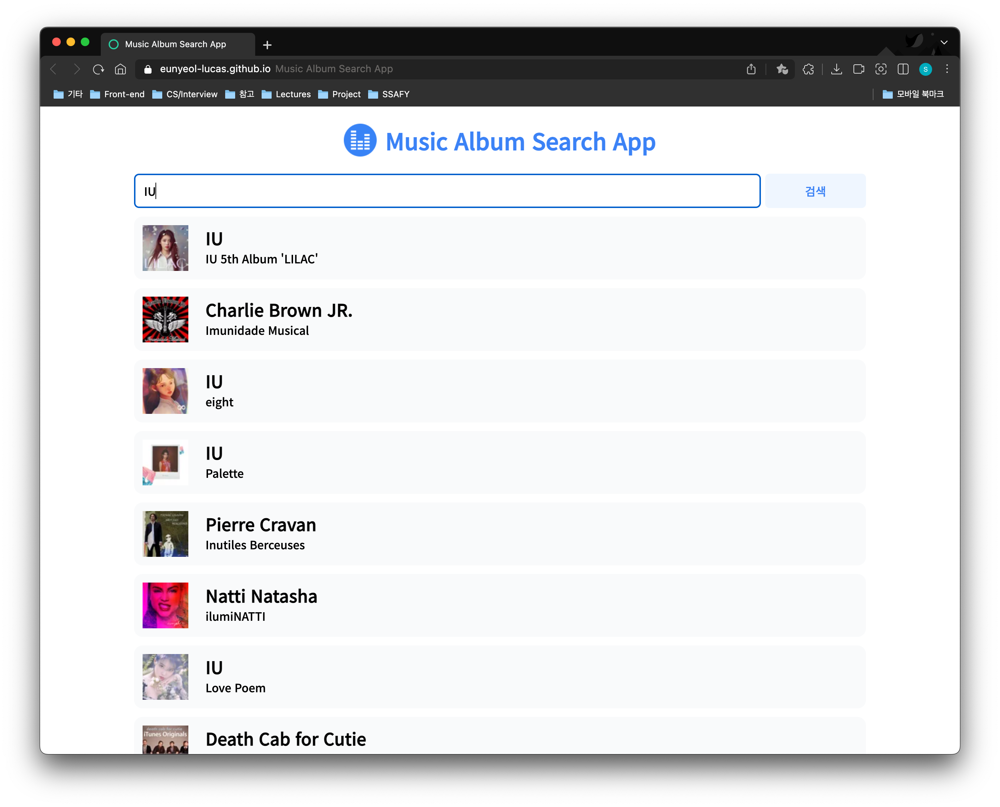

<div align="center">
	
  <p>
    	<a href="https://eunyeol-lucas.github.io/music-app/" target="_blank">Music app 체험하기 </a> 👈 클릭
  </p>
 </div>

⏰ **시행 날짜:** 2022.05.03 - 05.04

🍀 **개발환경:** Visual Studio Code

👄 **개발언어:** html, css, JavaScript

**🛠 개발 도구**

- Visual Studio Code
- Google Chrome Browser
- last.fm API
- intersectionObserver api

---

## 🎯 필수 기능

### 1. 검색창 (DOM & Event)

- 사용자가 input에 value를 입력할 경우, 해당 입력값을 기준으로 데이터를 실시간 요청합니다.

### 2. API 요청 (Ajax)

- 사용자가 입력한 검색어(keyword)를 포함하여 앨범 검색 요청을 보냅니다.
- (참고 문서) https://www.last.fm/api/show/album.search

- 앨범 검색을 위한 ajax 요청에는 `axios`를 활용합니다.
- 요청이 실패했을 경우 `alert()`를 이용하여 `잠시 후 다시 시도해주세요` 라는 메세지를 출력합니다.

### 3. 검색 결과 (DOM & Event)

- 검색 결과를 input 창 아래에 띄웁니다.
- 검색 결과가 나타나기 전 skeleton loader를 띄워 사용자에게 데이터가 요청 중임을 알립니다.
- 무한 스크롤을 통해 페이지 스크롤 시 새로운 데이터를 서버에 요청합니다.

---

## 🌏 실제 페이지

### 검색 페이지

<div align="center">
	
 </div>

### input 입력시 데이터를 요청

<div align="center">
	
 </div>


### 검색 결과가 없는 경우

<div align="center">
	
 </div>


---

## 🏋🏻‍♀️ 핵심 기능

1. infinite Scroll 구현

   intersectionObserver API를 활용하여 무한 스크롤로 해당 검색 기능을 구현하였습니다.

   검색어와 관련된 모든 데이터를 요청하되, 사용자가 스크롤을 통해 페이지를 이동하지 않아도 더 많은 음악 앨범을 확인할 수 있습니다.

   - intersection Observer API란?
     - 타겟 요소와 상위 요소 또는 최상위 document의 viewport 사이의 intersection 내의 변화를 비동기적으로 관찰하는 방법
     - 비동기적으로 실행되기 때문에 메인 스레이드에 영향을 주지 않으면서 변경 사항을 관찰할 수 있으며, 따로 getBoundingClientRect() 함수를 호출할 필요가 없어 **리플로우 현상**을 방지할 수 있습니다.

2. throttling

   검색어를 입력했을 때 'enter'를 누를 때 보다 input에 따라 데이터를 요청하는 것이 사용자 경험 측면에서 이점이 있을 것이라 생각했습니다.

   하지만 모든 key 입력에 따라 데이터를 요청하는 것은 서버에 과도한 요청을 줄 수 있기 때문에 throttle 함수를 구현하여, 일정 시간마다 서버에 데이터를 요청하도록 하였습니다.

   ```javascript
   export const throttle = (cb, delay) => {
     let timerId;
     return (e) => {
       if (timerId) return;
       timerId = setTimeout(
         () => {
           cb(e);
           timerId = null;
         },
         delay,
         e
       );
     };
   };
   
   ```

   - debounce와 throttle의 차이
     - debounce: 연이어 호출되는 함수 중 마지막 함수만 호출하도록 하는 것
     - throttle: 마지막 함수가 호출된 후 일정 시간이 지나기 전에 다시 호출되지 않도록 하는 것으로, 이벤트를 일정한 주기마다 발생하도록 합니다.

---

## 🚨 문제 및 해결

1. 검색어 삭제 시 마지막 기록이 남아있는 문제

input에 입력된 글을 backspace를 통해 삭제할 경우, 첫 글자로 요청된 데이터가 dom 상에 남아있는 문제가 발생하였습니다. input의 값을 삭제하였을 경우 앨범이 나타나는 요소에 데이터를 삭제하기 위하여 backspace에 대한 이벤트를 부여하였습니다.

```javascript
searchInput.addEventListener("keyup", (e) => {
    if (e.key === "Backspace" && searchInput.value === "")
      searchResult.innerHTML = "";
    loadingList.style.display = "none";
  });
```

2, 무한 스크롤 시 target unobserve

처음 무한 스크롤을 구현하였을 때, observer가 인식하기 위한 target으로

``` javascript
const observePoint = document.createElement("div");
createObserver(observePoint);

// ...생략

const renderAlbums = async (albums) => {
  const fragment = document.createDocumentFragment();
  albums.forEach((album) => fragment.append(albumTemplate(album)));
  searchResult.append(fragment);
  searchResult.append(observePoint);
};
```

observePoint에 해당하는 element를 생성하여, 요청된 앨범 데이터 뒤에 매번 해당 element를 추가해주는 방식으로 하였습니다. 하지만 해당 방법을 통해 구현한 무한 스크롤에서는 해당 target point를 unobserve를 시키지 못하였습니다.

```javascript
function createObserver(target) {
  const options = {
    threshold: 0,
  };
  const observer = new IntersectionObserver((entries) => {
    entries.forEach((entry) => {
      if (entry.isIntersecting) {
        api.page += 1;
        fetchAlbums(api.page);
      }
    });
  }, options);
  observer.observe(target);
}
```

 그렇기 때문에 또다시 viewport에 접근할 경우 또다시 fetch를 하는 문제가 발생하였습니다.

- 첫 번째 방법

unobserve를 시키기 위해서 해당 intersectionObserver 코드를 변경하였습니다.
앨범 요소의 마지막 요소를 target으로 관찰하도록 코드를 변경

마지막 위치를 target으로 하여 관찰하였을 때, 처음으로 받은 앨범 데이터의 마지막 데이터가 뷰 포트에 접근을 하였을 경우, 10여번의 요청이 발생하였습니다. 

해당 방법을 수정하기 위해 아래와 같이 코드를 수정하여, 기존의 누적된 앨범 개수와 현재 받아온 데이터의 개수가 다른 경우에 해당 앨범의 마지막 요소를 관찰 요소로 설정하였습니다.

``` javascript
let albumCount = 0;

const ioCallback = (entries, io) => {
  entries.forEach((entry) => {
    if (entry.isIntersecting) {
      io.unobserve(entry.target);
      api.page += 1;
      fetchAlbums(api.page);
      observeLastItem(io, document.querySelectorAll(".search-result__card"));
    }
  });
};

const observeLastItem = (io, items) => {
  if (!items) return;
  const lastItem = items[items.length - 1];
  if (!lastItem) return;
  if (albumCount !== items.length) io.observe(lastItem);
  albumCount = items.length;
};

const io = new IntersectionObserver(ioCallback, { threshold: 1 });
```

🚨 문제 발생

전달 받은 데이터를 누적하여 앨범 개수와 다를 경우에만 새로운 데이터를 요청하도록 하였지만, 2 페이지에서 더이상 요청이 가지 않은 문제가 발생하였습니다. 

또한 매번 요청하는 데이터의 길이를 제는 것은 불필요한 행위라 생각하여 data-* 속성을 사용하여 코드를 변경하기로 하였습니다.

- 두 번쨰 방법

```javascript
const ioCallback = (entries, io) => {
  entries.forEach((entry) => {
    if (entry.isIntersecting) {
      io.unobserve(entry.target);
      delete entry.target.dataset.id;
      requestInfo.page += 1;
      fetchAlbums(requestInfo.page);
    }
  });
};

const observeLastItem = (io) => {
  const target = $(".search-result").querySelector('[data-id="target"]');
  if (!target) return;
  io.observe(target);
};
const io = new IntersectionObserver(ioCallback, { threshold: 1 });

// ... 생략

const renderAlbums = async (albums) => {
  const fragment = document.createDocumentFragment();
  const count = albums.length;
  albums.forEach((album, idx) =>
    fragment.append(albumTemplate(album, idx, count))
  );
  searchResult.append(fragment);
  observeLastItem(io);
};

```

전달받은 앨범 데이터의 마지막 요소에 data 속성을 통해 마지막 element임을 표시한 뒤, 해당 target을 observer를 통해 관찰하여 viewport에 들어오는 경우, 새롭게 data를 요청하고, target을 unobserve를 시켜 다시 뷰포트에 들어와도 fetch가 발생하지 않도록 하였습니다.

해당 방법을 통해 매 새로운 데이터가 들어올 경우, 마지막 데이터를 관찰 포인트로 지정하여 해당 target이 뷰표트에 들어오는 경우에 1회씩 데이터를 요청할 수 있었습니다.

3. 입력값을 즉시 전달함에 따른 과도한 네트워크 요청

유저가 검색어를 입력하는 순간 서버에 요청을 보냈기 때문에 잦은 리렌더링이 발생하며, 서버에 과도한 요청이 발생하였습니다. 해당 문제를 해결하기 위해 throttle 개념을 도입하여, 일정 입력 시간 이후에 서버로 요청을 전달하도록 하여 서버 요청을 조절하였습니다.